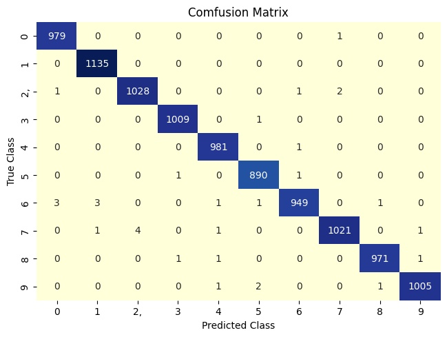

# Overview:
This repository contains code for a Convolutional Neural Network (CNN) implemented using both PyTorch and Keras libraries. The repository includes files for training the model from scratch, evaluating the performance of the model by loading pre-trained weights, and the neural network architecture. The MINST dataset is used for training the model.
# Requirements

## Required packages:
The required packages for PyTorch implementation are listed in separate requirements.txt files and can be installed using the following command:

```
pip install -r requirements.txt
```

```
matplotlib==3.2.2
numpy==1.21.6
opencv-python==4.6.0.66
pandas==1.3.5
scikit-learn==1.0.2
scipy==1.7.3
seaborn==0.11.2
tensorboard==2.9.1
torch==1.12.0
torchvision==0.13.0
tqdm==2.2.3
```


# This Repository contains several files:
1)  'NeuralNet.py' contains the CNN architecture implemented using PyTorch.
2)  'Train.py' file is used for training the model from scratch using PyTorch.
3)  'Evaluation.py' file is used for testing the model using trained model and evaluate using confusion matrix.

## Results: Confusion Martix:

